# Restaurant Website
I am uploading screenshots of running project. I haven't upload the actual files because some part of code contains my personal infomation. 

## Screenshots of Running Project
Home Page 
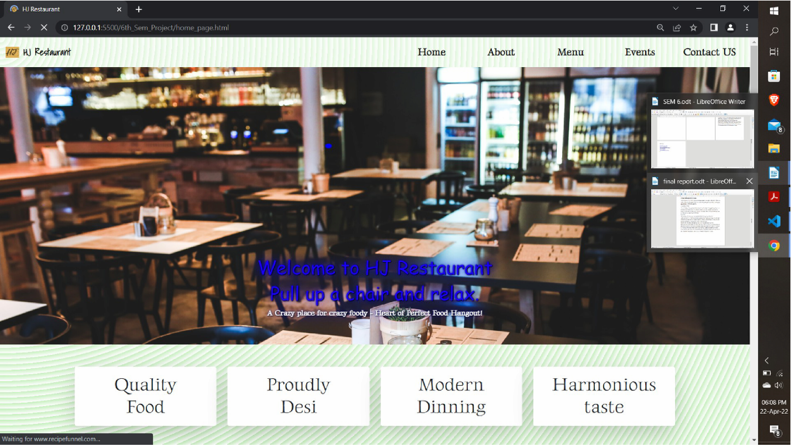
About Us Page 
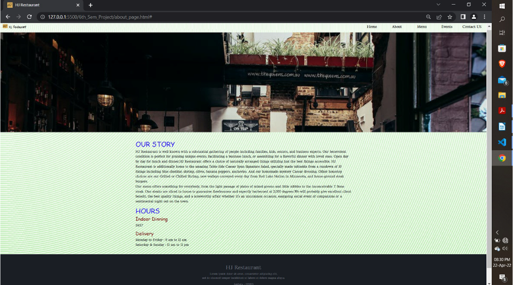
Menu Page (Online Booking Menu) 
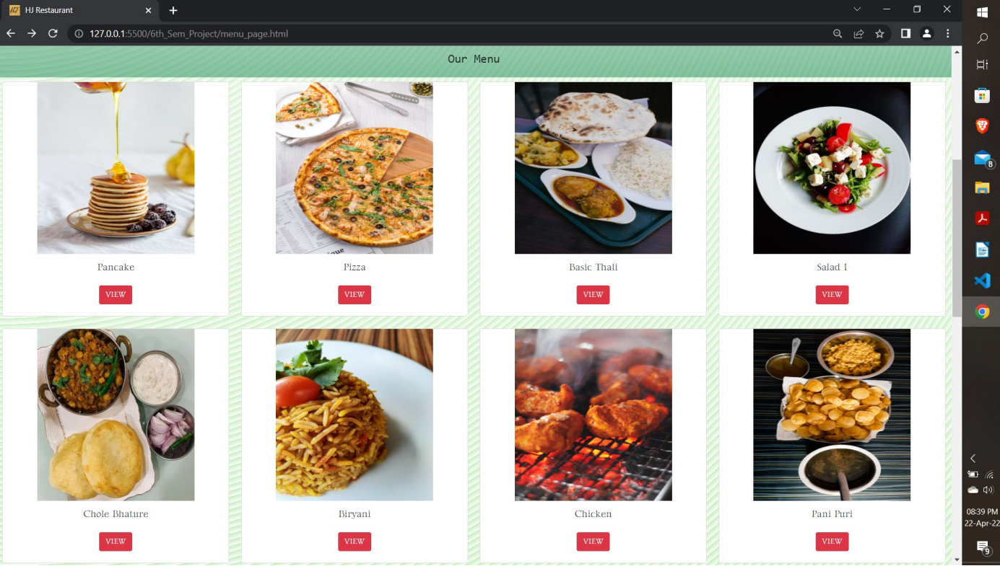
Login Page 
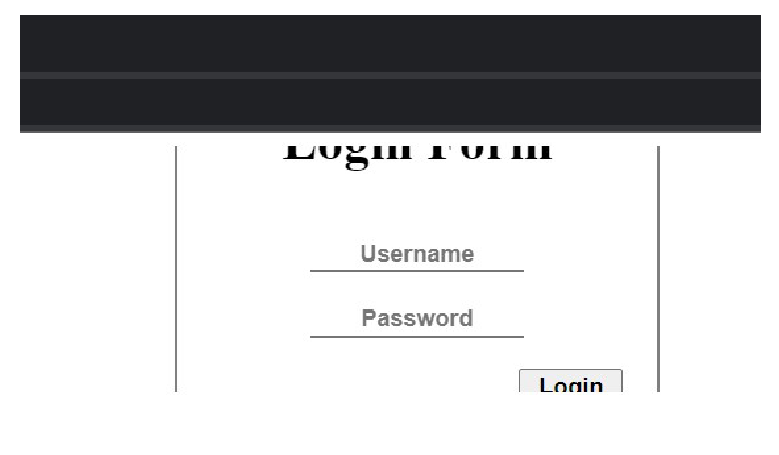
Creating account Page 
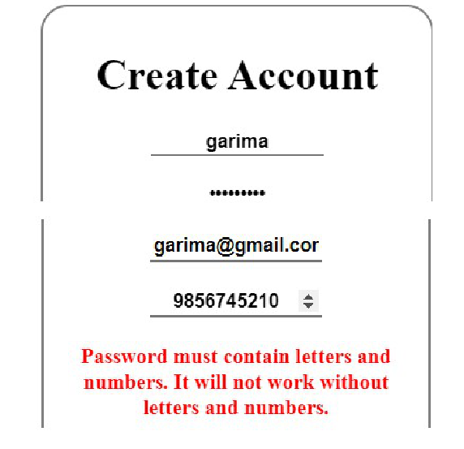
Account created 
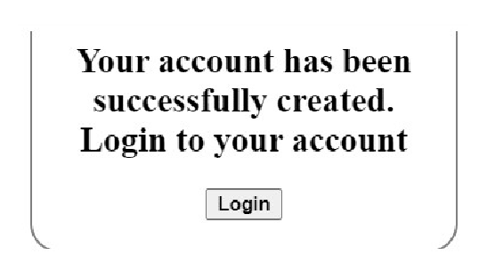
Data stored in google sheet 
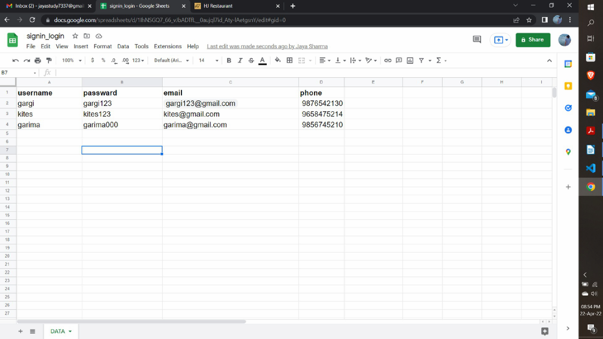
Login 
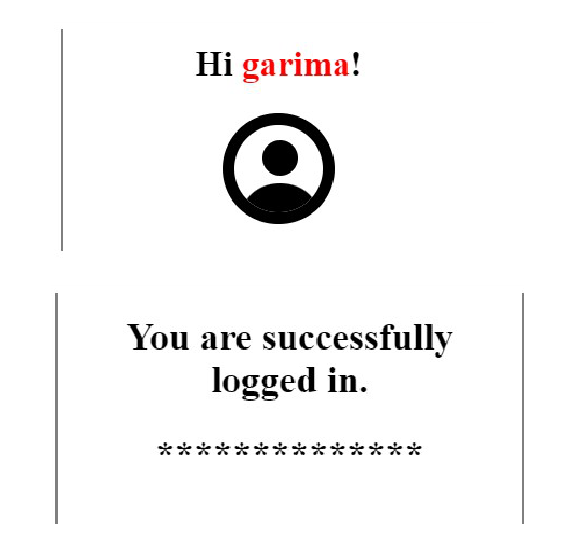
Login Failed 
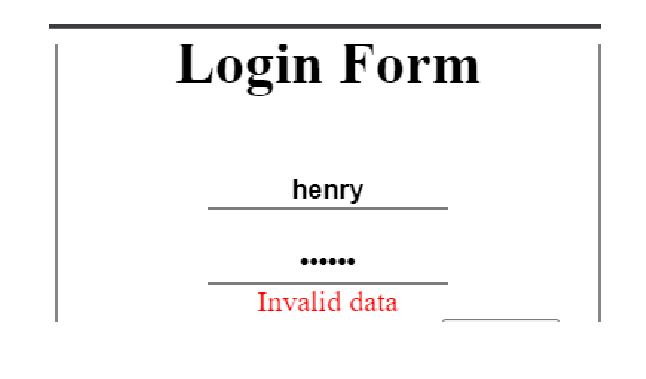
Dinning Menu 
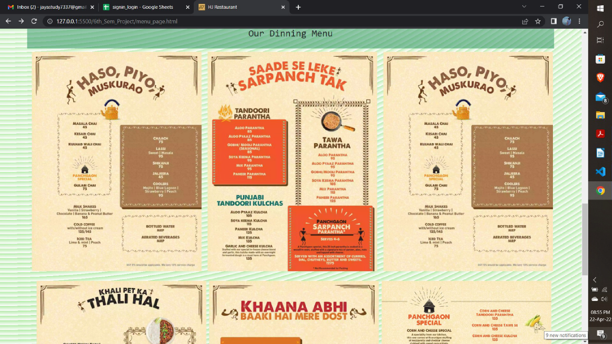
Event Page 
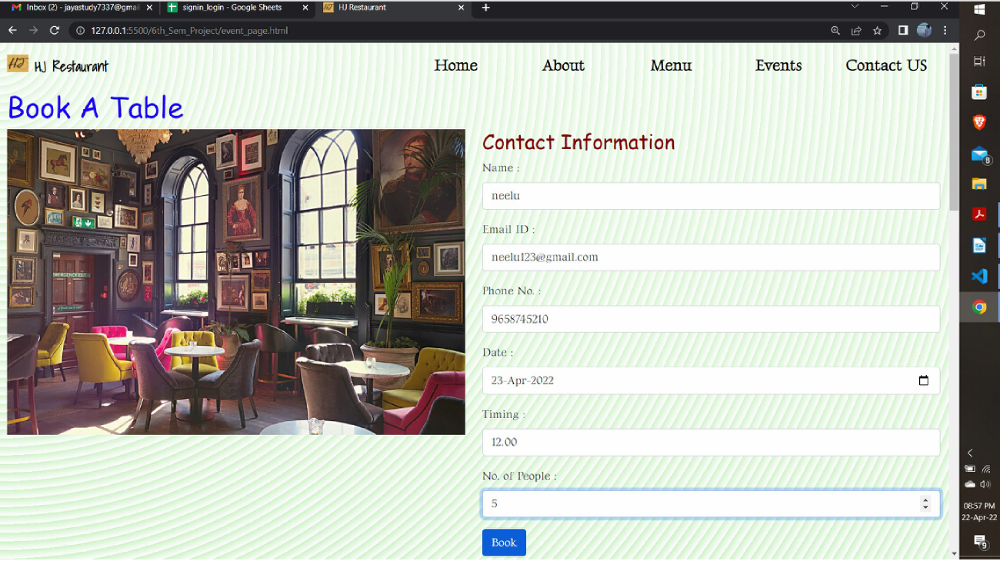
Sending data to whatsapp 
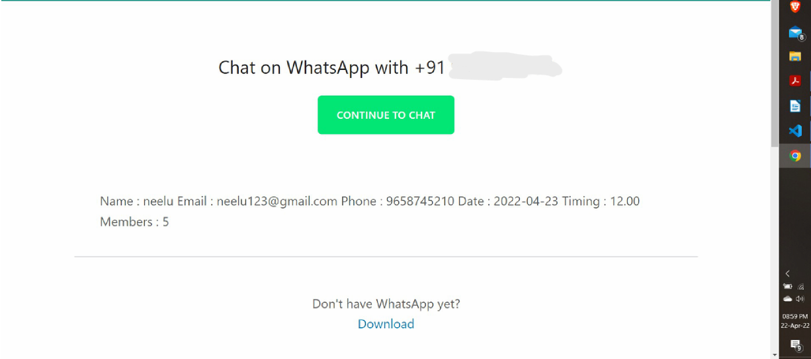
Contact Us Page 
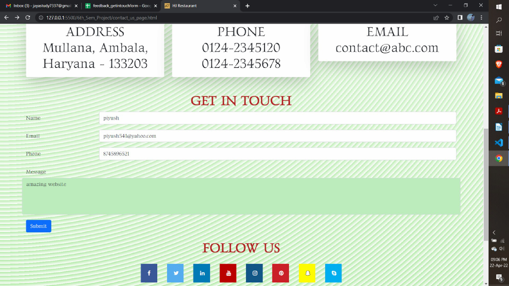
Storing feedback data in a google sheet 
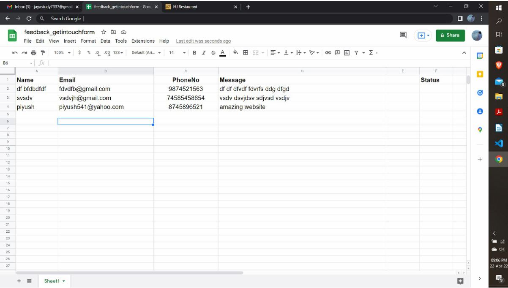
